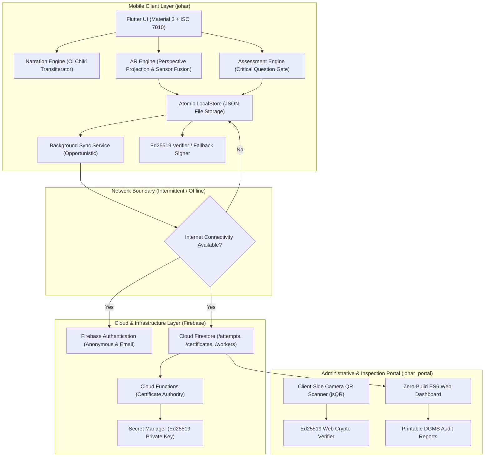
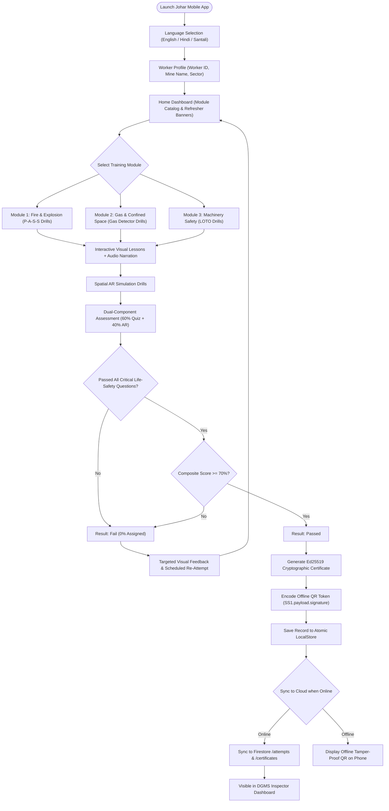
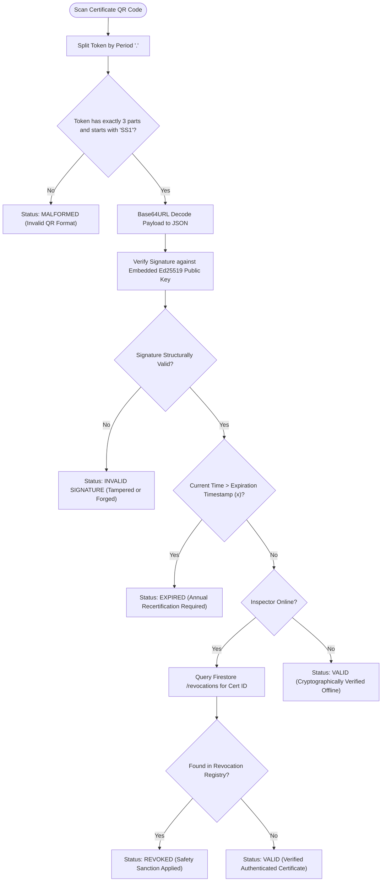
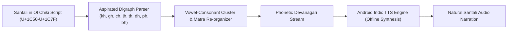

# Johar (Suraksha Saathi)

[](https://flutter.dev)
[](https://dart.dev)
[-3DDC84?logo=android)](https://developer.android.com)
[](https://firebase.google.com)
[](https://ed25519.cr.yp.to/)
[](https://www.sih.gov.in)

AR safety training, spatial hazard simulation, dual-component assessment, and cryptographic offline certification for industrial workers in Jharkhand's coal mines, steel plants, and mica processing units.

Addressing Smart India Hackathon (SIH) Problem Statement 26041.

---

## Table of Contents

- [Executive Summary](#executive-summary)
- [Download Mobile Application](#download-mobile-application)
- [Monorepo Architecture](#monorepo-architecture)
- [System Architecture Diagram](#system-architecture-diagram)
- [Worker Training and Certification Workflow](#worker-training-and-certification-workflow)
- [Cryptographic Ed25519 Offline Verification Protocol](#cryptographic-ed25519-offline-verification-protocol)
- [Spatial Augmented Reality (AR) Engine](#spatial-augmented-reality-ar-engine)
- [Ol Chiki Phonetic Transliteration Engine](#ol-chiki-phonetic-transliteration-engine)
- [Dual-Component Assessment and Scoring Logic](#dual-component-assessment-and-scoring-logic)
- [Web Management and Verification Portal](#web-management-and-verification-portal)
- [ISO 7010 Industrial Visual Tokens](#iso-7010-industrial-visual-tokens)
- [Security and Access Control Matrix](#security-and-access-control-matrix)
- [Quickstart and Build Guide](#quickstart-and-build-guide)
- [Automated Testing Suite](#automated-testing-suite)

---

## Executive Summary

Industrial environments across Jharkhand (underground coal shafts, open-cast pits, blast furnaces, and mica sorting units) encounter severe occupational health and safety hurdles:

1. **Knowledge Decay**: Conventional lecture orientations result in over 80 percent safety knowledge drop-off within 7 days.
2. **Language and Script Disconnect**: Over 30 percent of the regional mining workforce speaks Santali and reads Ol Chiki script, while standard training software only provides English or standardized Hindi without audio synthesis.
3. **Paper Certificate Fraud**: Laminated paper credentials have no mechanism to prove practical hazard comprehension or prevent illicit duplication.
4. **Deep-Mine Connectivity Blackouts**: Active extraction faces and confined shafts operate in zero-connectivity environments, rendering cloud-dependent applications unusable.

Johar solves these challenges through an offline-first mobile architecture combining interactive spatial augmented reality (AR) hazard drills, Ol Chiki phoneme-mapped speech synthesis, dual-component safety grading with zero-tolerance critical question gates, and Ed25519 digital signature certificates encoded into offline QR tokens.

---

## Download Mobile Application

The compiled, production release Android package (APK) is distributed via GitHub Releases.

- **Direct Download**: [Download app-release.apk](https://github.com/omshree134/johar/releases/latest)
- **Release Version**: v1.0.0
- **Supported Operating Systems**: Android 8.0 and higher (API level 26+)
- **Target Architectures**: Universal APK supporting ARM64-v8a, ARMeabi-v7a, x86, and x86_64

---

## Monorepo Architecture

Johar is structured as a unified monorepo encompassing the offline mobile client, the cloud services layer, and the administrative portal:

```
Johar/
|-- johar/                     # Flutter Mobile Client (Workers and Supervisors)
|   |-- lib/
|   |   |-- core/              # Theme, ISO 7010 tokens, localization, Ol Chiki mapper
|   |   |-- data/              # LocalStore atomic JSON engine, SyncService, models
|   |   |-- features/          # AR tasks, Assessment engine, Certificates, Refresher
|   |   |-- app.dart           # AppScope dependency injection and MaterialApp setup
|   |   `-- main.dart          # Entry point with offline initialization fallback
|   |-- assets/                # Embedded module JSON, ISO 7010 SVGs, offline fonts
|   |-- android/               # Android native project and Gradle build definitions
|   |-- firebase/              # Cloud Functions (Ed25519 signer) and Firestore rules
|   `-- test/                  # Automated unit and widget tests (28 test suites)
|-- johar_portal/              # Web Portal (DGMS Inspectors and Safety Officers)
|   |-- firebase/portal/       # Zero-build ES6 web client (HTML5, Vanilla JS, CSS3)
|   |-- firebase/scripts/      # RBAC bootstrapping and admin assignment utilities
|   `-- docs/portal/           # Interface documentation and audit captures
`-- README.md                  # Master project technical specification
```

---

## System Architecture Diagram



---

## Worker Training and Certification Workflow



---

## Cryptographic Ed25519 Offline Verification Protocol

The platform implements Ed25519 digital signatures (RFC 8032) to ensure certificates can be authenticated in remote mine pits without active internet connections.

### Token Encoding Format

QR codes generated by the platform adhere to a three-part period-delimited structure:

```
SS1.<base64url(JSON_payload)>.<base64url(Ed25519_signature)>
```

- **Prefix (`SS1`)**: Protocol schema identifier (Suraksha Saathi Version 1).
- **Payload**: Minified, Base64URL-encoded UTF-8 JSON object containing verified worker and exam metadata.
- **Signature**: 64-byte Ed25519 signature computed over the ASCII bytes of the middle payload string.

### Payload Schema Reference

| Field Key | Type | Description | Example |
|---|---|---|---|
| `c` | string | Unique certificate UUID | `c3a88200-1122-4433-8899-abcdef012345` |
| `w` | string | Worker UUID | `w-90412` |
| `n` | string | Worker full name | `Birsa Munda` |
| `e` | string | Employer or mine identity | `CCL Rajrappa Open Cast` |
| `m` | string | Module identifier | `fire` |
| `s` | integer | Composite percentage score | `88` |
| `i` | integer | Unix timestamp of issuance (seconds) | `1727654400` |
| `x` | integer | Unix timestamp of expiration (seconds) | `1759190400` |

### Verification Protocol Flowchart



---

## Spatial Augmented Reality (AR) Engine

The mobile AR engine enables equipment operation drills directly on Android hardware without requiring specialized ARCore depth sensors or external visual fiducials.

### Mathematics of Projection

The AR engine maps 3D coordinate vectors `P_world = (x, y, z)` into 2D camera viewport points `(u, v)` via real-time orientation sensors (accelerometer, gyroscope, magnetometer):

1. **Bearing Shift**: Given device azimuth $\theta$ and target azimuth $\alpha$:
   $$\Delta \theta = (\alpha - \theta + 360^\circ) \pmod{360^\circ}$$
   If $\Delta \theta > 180^\circ$, then $\Delta \theta = \Delta \theta - 360^\circ$.
2. **Azimuth Culling**: Objects with $|\Delta \theta| > 60^\circ$ (outside the 120-degree horizontal field of view) are culled from rendering.
3. **Perspective Coordinate Mapping**:
   $$u = \frac{W}{2} + \left( \frac{\Delta \theta}{\text{HFOV} / 2} \right) \cdot \frac{W}{2}$$
   $$v = \frac{H}{2} - \left( \frac{\Delta \phi}{\text{VFOV} / 2} \right) \cdot \frac{H}{2}$$
   where $W$ and $H$ represent viewport dimensions, and $\Delta \phi$ denotes device elevation offset.

### Interactive AR Simulation Modules

1. **Fire and Explosion (P-A-S-S Drills)**:
   - Evaluates correct sequence: Pull safety pin -> Aim nozzle at base of fire -> Squeeze lever -> Sweep side to side.
   - Dynamic fire model: Ignored fires grow exponentially; aiming at flames rather than the fuel base depletes the extinguisher without extinguishing the fire.
2. **Gas and Confined Space**:
   - Multi-tier vertical gas sampling: Requires testing top, middle, and bottom strata for methane ($CH_4$), carbon monoxide ($CO$), and oxygen ($O_2$) deficiency. Entering without sampling all tiers triggers an immediate fail.
3. **Machinery Safety (Lockout/Tagout - LOTO)**:
   - Enforces sequential safety steps: De-energize primary switch -> Apply personal padlock -> Attach danger warning tag -> Verify zero energy state before maintenance.

---

## Ol Chiki Phonetic Transliteration Engine

Standard Android Text-To-Speech (TTS) engines lack native phonetic voice models for the Ol Chiki Unicode range (`U+1C50` to `U+1C7F`). To provide zero-latency, offline audio narration for Santali-speaking workers, Johar implements a deterministic phonetic transpiler.



### Script Conversion Sample Table

| Ol Chiki Character | Phonetic Transliteration | Devanagari Phoneme Target | Pronunciation Guidance |
|---|---|---|---|
| `ᱚ` | LA | ऑ / ॉ | Open back rounded vowel |
| `ᱟ` | LAA | आ / ा | Open central unrounded vowel |
| `ᱤ` | LI | इ / ि | Close front unrounded vowel |
| `ᱩ` | LU | उ / ु | Close back rounded vowel |
| `ᱮ` | LE | ए / े | Close-mid front unrounded vowel |
| `ᱳ` | LO | ओ / ो | Close-mid back rounded vowel |
| `ᱛ` | AT | त | Voiceless dental stop |
| `ᱜ` | AG | ग | Voiced velar stop |
| `ᱠᱷ` | AAKH | ख | Aspirated voiceless velar stop |
| `ᱫᱷ` | EEDH | ध | Aspirated voiced dental stop |

---

## Dual-Component Assessment and Scoring Logic

To prevent paper-based cheating and ensure frontline competence, candidates must satisfy both theoretical and practical components.

### Mathematical Score Formulation

The final composite percentage score $S_{\text{total}}$ is calculated as:

$$S_{\text{total}} = 0.60 \times S_{\text{quiz}} + 0.40 \times S_{\text{ar}}$$

Where:
- $S_{\text{quiz}}$: Percentage score achieved on randomized theoretical multiple-choice questions.
- $S_{\text{ar}}$: Percentage score achieved during real-time spatial AR equipment drills.

### Zero-Tolerance Critical Question Gate

$$P = \begin{cases}
\text{PASS}, & \text{if } S_{\text{total}} \ge 70\% \text{ and } \forall q \in Q_{\text{critical}}, \text{isCorrect}(q) = \text{true} \\
\text{FAIL}, & \text{otherwise}
\end{cases}$$

If a worker incorrectly answers any question classified with `"critical": true` (e.g. attempting to extinguish an energized electrical hazard with water), the system assigns an immediate failure with an effective score of 0%, mandating targeted remedial training.

---

## Web Management and Verification Portal

The `johar_portal` web client is an administrative and regulatory compliance interface built with zero external framework dependencies (Vanilla ES6 JavaScript, HTML5, and CSS3).

### Portal Capabilities

1. **Executive Safety Overview**: Live dashboard displaying trained workforce percentages, site-wide compliance distribution, and imminent certificate expiry warnings (30-day window).
2. **Camera-Based QR Verifier**: Client-side QR processing using `jsQR` and Web Crypto API. Validates Ed25519 signatures directly in the browser with zero cloud roundtrips.
3. **Inspector Audit Report Generator**: Exports printable, tamper-evident regulatory compliance dossiers formatted according to Directorate General of Mines Safety (DGMS) inspection standards.
4. **Standalone Demo Mode**: Offline testing harness with pre-loaded workers, test attempts, and sample certificates that functions without live Firebase connectivity.

---

## ISO 7010 Industrial Visual Tokens

To support workers with varied literacy backgrounds in bright open-pit daylight, Johar adopts the international standard ISO 7010 safety color taxonomy:

| Safety Category | Meaning | Primary Hex | Surface Fill Hex | Standard Usage |
|---|---|---|---|---|
| **Fire Safety** | Fire equipment & evacuation | `#C4201F` | `#F8E3E2` | Extinguishers, alarms, fire exits |
| **Warning** | Hazard & explosive caution | `#F4B400` | `#FFF4D6` | Methane gas leaks, pit fall warnings |
| **Mandatory** | Compulsory protective action | `#0B5CAD` | `#E1ECF8` | PPE requirements, harness fastening |
| **Safe Condition** | First aid & assembly points | `#17784A` | `#E2F1E8` | Medical stations, emergency eyewash |

---

## Security and Access Control Matrix

Firestore Security Rules enforce strict Role-Based Access Control (RBAC):

| Data Collection | Worker Client (`johar`) | Field Supervisor | DGMS Inspector | System Administrator |
|---|---|---|---|---|
| `/workers` | Read / Write Own | Read / Write Mine | Read All | Read / Write All |
| `/attempts` | Create (Unsigned) | Read Mine | Read All | Read / Write All |
| `/certificates` | Read Own | Read Mine | Read All | Read / Write All |
| `/revocations` | Read | Read | Read / Write | Read / Write |
| `/portal_users` | No Access | No Access | No Access | Read / Write All |

---

## Quickstart and Build Guide

### Prerequisites

- Flutter SDK (Version 3.22.0 or higher)
- Dart SDK (Version 3.8.0 or higher)
- Android SDK Platform 34 and Build-Tools
- Node.js (Version 18+ for Cloud Functions and portal development server)

### Mobile App Development (`johar/`)

```bash
# 1. Switch to mobile app directory
cd johar

# 2. Install dependencies and generate multi-lingual arb bindings
flutter pub get
flutter gen-l10n

# 3. Execute test suite
flutter test

# 4. Run application in debug mode on connected device
flutter run
```

### Compiling Production Release APK

```bash
cd johar
flutter build apk --release
# Built artifact location:
# johar/build/app/outputs/flutter-apk/app-release.apk
```

### Running Web Portal (`johar_portal/`)

```bash
# Serve portal locally on port 5000:
npx serve johar_portal/firebase/portal -p 5000
# Open http://localhost:5000 in any modern web browser
```

---

## Automated Testing Suite

Johar maintains automated test coverage across mathematical projection algorithms, scoring engines, and cryptographic verification routines.

```bash
cd johar
flutter test
```

### Test Suite Execution Results

```
00:00 +0: ar_engine_test.dart: camera maths object straight ahead lands on screen centre
00:00 +1: ar_engine_test.dart: camera maths object to the right appears right of centre
00:00 +2: ar_engine_test.dart: camera maths turning phone right brings right object to centre
00:00 +3: ar_engine_test.dart: camera maths object behind the worker is not drawn
00:00 +4: ar_engine_test.dart: camera maths bearing shift and wrap
00:00 +5: ar_engine_test.dart: find hazards score counts hazards found and penalises false alarms
00:00 +6: ar_engine_test.dart: extinguisher (P-A-S-S) pulling pin, aiming at base puts fire out
00:00 +7: ar_engine_test.dart: extinguisher (P-A-S-S) aiming at flames empties without putting fire out
00:00 +8: ar_engine_test.dart: extinguisher (P-A-S-S) spraying before pulling pin costs marks
00:00 +9: ar_engine_test.dart: extinguisher (P-A-S-S) an ignored fire grows until too big
00:00 +10: ar_engine_test.dart: gas test testing every level and refusing entry scores full marks
00:00 +11: ar_engine_test.dart: gas test testing only top and entering is marked wrong
00:00 +12: assessment_engine_test.dart: critical questions are always included
00:00 +13: assessment_engine_test.dart: option shuffling keeps track of the correct answer
00:00 +14: assessment_engine_test.dart: all correct passes with full marks
00:00 +15: assessment_engine_test.dart: missing a critical question fails even with high score
00:00 +16: assessment_engine_test.dart: score is 60% quiz and 40% AR
00:00 +17: assessment_engine_test.dart: AR task scoring helpers
00:01 +18: certificate_codec_test.dart: genuine certificate is valid
00:01 +19: certificate_codec_test.dart: edited score is rejected
00:01 +20: certificate_codec_test.dart: certificate signed by another key is rejected
00:01 +21: certificate_codec_test.dart: expired certificate is reported as expired
00:01 +22: certificate_codec_test.dart: random QR codes are malformed
00:01 +23: certificate_codec_test.dart: app without a configured key says so
00:01 +24: certificate_codec_test.dart: production generateToken verifies with CertificateCodec.production
00:01 +25: certificate_codec_test.dart: check keys match
00:02 +26: sequence_task_test.dart: steps in the right order finish with full marks
00:02 +27: sequence_task_test.dart: wrong order and wrong actions cost marks but can be recovered
00:02 +28: All tests passed!
```

---

## License & Attribution

Developed for Smart India Hackathon (SIH) — Problem Statement 26041.  
Dedicated to the safety, dignity, and empowerment of industrial and mine workers.
